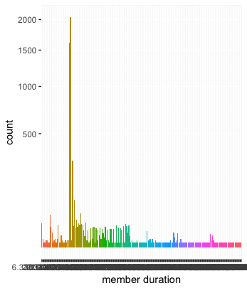
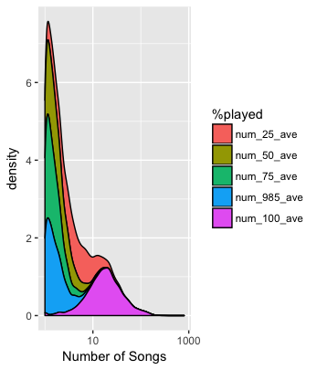
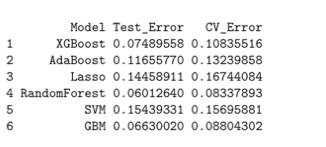
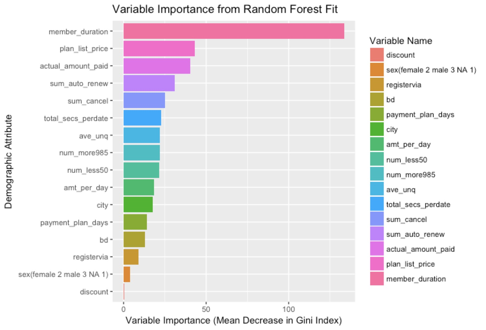
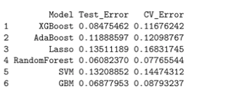

# ADS Project 5: Churn Prediction for KKBox

Term: Fall 2017

+ Team #2
+ Project title: Churn Prediction for KKBox
  
+ Team members
	+ Xinyao Guo  (xg2257)
	+ Qingyun Lu  (ql2273)
	+ Peilin Qiu  (pq2128)
	+ Sijian Xuan (sx2195)
	+ Yi Zhang    (yz3006)
+ Project summary: 
KKBox is a leading music streaming service in Asia. The objective of our project is to built an algorithm that predicts whether a subscription user will churn after their membership expiration for KKBOX. The data we used consists of three kinds of features: User information in members, transactions and user logs. Before going into the analysis of features, we merged all datasets and sample 5000 commom users as our data. Our pipeline is broken down into 4 steps. <br />

+Step 1: Feature Analysis on EDA <br />
 <br />
 <br />
+Step 2: Split the dataset and set the evaluation metric <br />
 <br />
+Step 3: Train the models and get the error rate using testing data <br />
+Step 4: Cross Validation to select the best model <br />
 <br />
+Step 5: Feature Importance for Random Forest and XGBoost <br />
  <br />
+Step 6: Reduce the features and test the model
 <br />
+Step 7: Further Investigation

**Contribution statement**: ([default](doc/a_note_on_contributions.md)) All team members contributed equally in all stages of this project. All team members approve our work presented in this GitHub repository including this contributions statement. 

Following [suggestions](http://nicercode.github.io/blog/2013-04-05-projects/) by [RICH FITZJOHN](http://nicercode.github.io/about/#Team) (@richfitz). This folder is orgarnized as follows.

```
proj/
├── lib/
├── data/
├── doc/
├── figs/
└── output/
```

Please see each subfolder for a README file.
